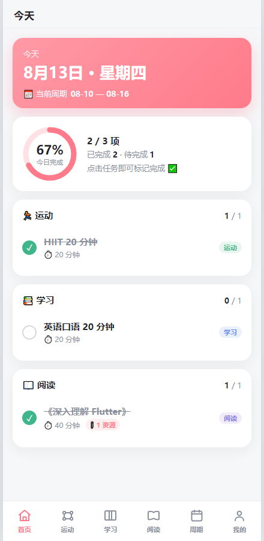
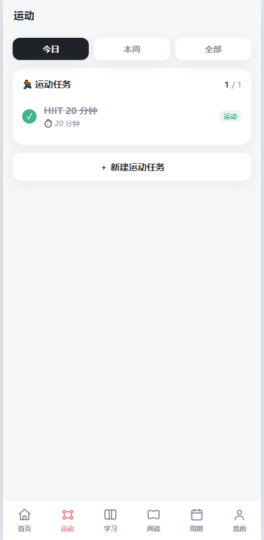
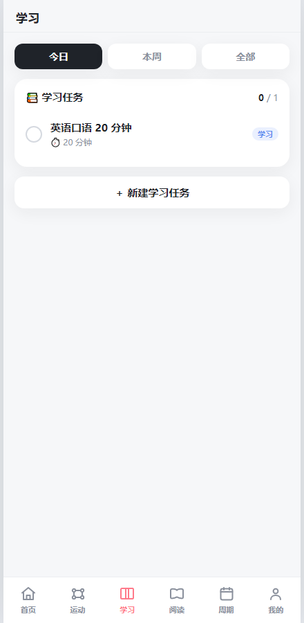
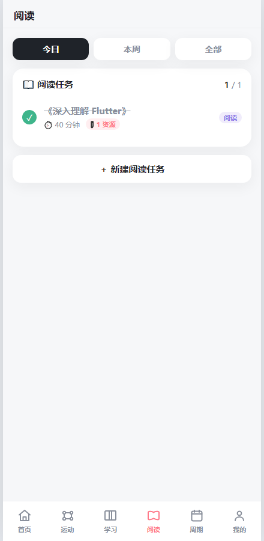
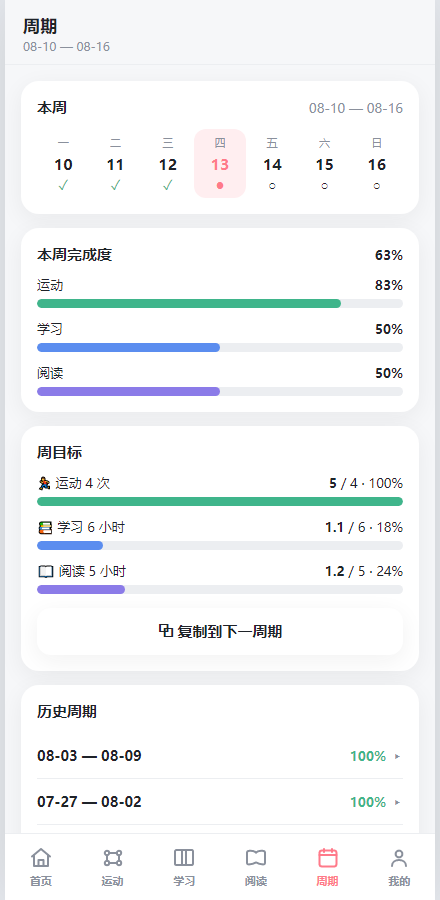
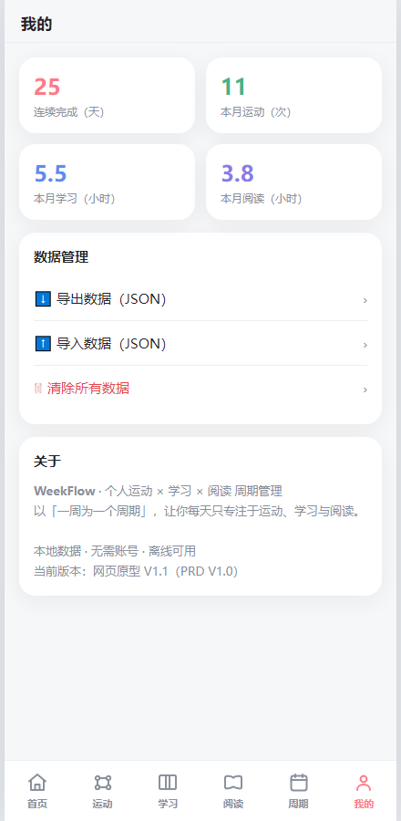

# WeekFlow · 个人运动 × 学习周期管理

> 以「一周」为一个周期，专注今天。一个帮你把运动和学习都照顾到的极简本地 App。
> *WeekFlow — a calm, local-first weekly planner for your workouts & studies.*

[](LICENSE)
[](release/)

---

## ✨ 功能特性

- 📅 **周期管理**：以周一～周日为一周；历史周期只读、默认折叠，减少焦虑
- 🏠 **今天优先**：首页一目了然今日「运动 / 学习 / 阅读」三件事的完成度
- 🏃 **运动** · 📚 **学习** · 📖 **阅读** 三大模块，结构完全一致（今日 / 本周 / 全部）
- ✅ 任务支持 **完成 / 编辑 / 删除 / 复制**，可填预计时长；阅读任务额外支持「预计页数」
- 🎬 **统一资源系统**：一个任务可绑定多个资源（本地视频 / B站 / PDF / 网页），点击按类型分派
  - 本地视频 → 进入独立播放器（播放 / 暂停 / 拖动进度 / 全屏 / 返回，文件缺失有提示）
  - B站 / 网页 / PDF → 调用系统外部应用打开（不内嵌 WebView）
- 📊 **周目标 & 完成度**：运动 / 学习 / 阅读分别统计，圆环 + 进度条
- 📈 **历史周期回顾**：每周完成率、每日明细，温柔鼓励不施压
- 💾 **本地优先**：不联网、不注册、数据存在本机（WebView 的 localStorage）
- 📤 **数据备份**：JSON 导出 / 导入 / 清除

---

## 📸 截图

| 首页 Home | 运动 Sport | 学习 Study |
| --- | --- | --- |
|  |  |  |

| 阅读 Reading | 周期 Cycle | 我的 Me |
| --- | --- | --- |
|  |  |  |

---

## 🏗 技术架构

WeekFlow 当前版本采用 **「原生 Android 壳 + 本地 HTML」** 方案：

- `web/index.html`：完整的应用逻辑（单文件 HTML + CSS + JS，数据存 `localStorage`）
- `android/`：一个轻量 Android 工程，用 `WebView` 加载 `assets/index.html`，把网页直接打包成可安装的 APK
- 数据完全本地，无云端依赖

> 这种方案让应用「改网页即可改功能」，也方便二次开发与跨平台复用。

---

## 📂 目录结构

```
WeekFlow/
├── web/
│   └── index.html                  # 应用核心（单文件网页，可直接用浏览器打开）
├── android/                        # Android 套壳工程（用于打包 APK）
│   ├── app/
│   │   └── src/main/
│   │       ├── assets/index.html   # 打包进 APK 的网页（= web/index.html 的副本）
│   │       ├── java/com/weekflow/app/MainActivity.java
│   │       ├── res/                # 图标 / 布局 / 主题
│   │       └── build.gradle
│   ├── build.gradle
│   ├── settings.gradle
│   ├── gradle.properties
│   ├── gradlew / gradlew.bat
│   └── gen_icons.py                # 用 PNG 生成各尺寸图标的脚本
├── screenshots/                    # 应用截图
├── release/
│   └── WeekFlow-v1.0.0-release.apk # 已打包的安装包
├── README.md
├── LICENSE
└── .gitignore
```

---

## 📦 安装

直接下载安装包即可：

👉 [`release/WeekFlow-v1.0.0-release.apk`](release/WeekFlow-v1.0.0-release.apk)

- 支持 **Android 7.0（API 24）及以上**
- Release 签名（v2 scheme），可直接安装
- 安装前若已存在同名旧版，建议先卸载再装，避免图标 / 缓存不刷新

---

## 🛠 从源码构建 APK

**环境要求**

- Android SDK（已配置 `ANDROID_HOME` 环境变量，或在 `android/local.properties` 写 `sdk.dir=...`）
- JDK 17（本工程在 Amazon Corretto 17 验证通过）

**步骤**

```bash
# 1. 进入 android 工程
cd android

# 2.（可选）如果你修改了 web/index.html，需同步进 APK 资源
cp ../web/index.html app/src/main/assets/index.html

# 3. 首次构建需要 release 签名密钥
keytool -genkey -v -keystore app/weekflow-release.keystore \
  -alias weekflow -keyalg RSA -keysize 2048 -validity 10000 \
  -storepass <你的密码> -keypass <你的密码> -dname "CN=WeekFlow"

# 4. 在 app/build.gradle 的 signingConfigs.release 中填好密钥路径与密码
#    （仓库已包含一份示例配置，替换为你自己的 keystore 即可）

# 5. 构建 Release APK
./gradlew assembleRelease --no-daemon
```

生成的 APK：`android/app/build/outputs/apk/release/app-release.apk`

> 若项目路径含中文导致 Gradle 报「非 ASCII 路径」错误，已在 `gradle.properties` 加入
> `android.overridePathCheck=true` 规避。

---

## ✏️ 如何修改应用

1. 编辑 `web/index.html`（应用全部逻辑都在这里，单文件）
2. 复制到 `android/app/src/main/assets/index.html`
3. 重新执行 `./gradlew assembleRelease --no-daemon`

或者直接双击 `web/index.html` 用浏览器打开预览效果。

---

## 🔒 隐私

- 不收集任何数据，不联网，不做埋点
- 所有任务 / 完成记录仅保存在你设备本机的 WebView `localStorage` 中

---

## 📄 License

[MIT](LICENSE) © 2026 yingying-moon
